<div align="center">

# Git Profile Awaken

**[ SYSTEM NOTIFICATION ] You have been chosen as a Player.**

Your GitHub profile, rendered as the System window from a LitRPG: ranks from E to EX measured against real GitHub players, a job class, titles you earn, achievements, and a year of contributions that rises as a shadow army. Ten README layouts, 31 themes, 602 logos for your arsenal. A GitHub Action rebuilds it every night.

<picture>
  <source media="(prefers-color-scheme: dark)" srcset="demo/hunter-dark.svg">
  <source media="(prefers-color-scheme: light)" srcset="demo/hunter-light.svg">
  
</picture>

<picture>
  <source media="(prefers-color-scheme: dark)" srcset="demo/ladder-dark.svg">
  <source media="(prefers-color-scheme: light)" srcset="demo/ladder-light.svg">
  
</picture>

<picture>
  <source media="(prefers-color-scheme: dark)" srcset="demo/activity-dark.svg">
  <source media="(prefers-color-scheme: light)" srcset="demo/activity-light.svg">
  
</picture>

</div>

Every number on these images is real and comes from the GitHub API. They are regenerated daily from [billtruong003](https://github.com/billtruong003).

**[Website and configurator](https://git-profile-awaken.vercel.app)** · **[User guide](docs/guide.md)** · **[Developer guide](docs/development.md)**

## Hall of Hunters

Well-known developers, drawn from their public data by the same code and refreshed every night.

<table>
<tr>
<td><a href="https://github.com/torvalds"></a></td>
<td><a href="https://github.com/gaearon"></a></td>
</tr>
<tr>
<td><a href="https://github.com/yyx990803"></a></td>
<td><a href="https://github.com/sindresorhus"></a></td>
</tr>
<tr>
<td><a href="https://github.com/karpathy"></a></td>
<td><a href="https://github.com/antfu"></a></td>
</tr>
</table>


## Quick start

You need a profile repository (the repository named after your username, the one whose README shows on your profile).

1. Add `awaken.json` at its root:

   ```json
   {
     "username": "YOUR_USERNAME",
     "layout": "default",
     "theme": "solo_leveling",
     "activity": "arise",
     "timezone": "Asia/Ho_Chi_Minh"
   }
   ```

2. Add `.github/workflows/awaken.yml`:

   ```yaml
   name: Awaken
   on:
     schedule:
       - cron: "10 17 * * *"   # 00:10 in UTC+7; the configurator works this out for your zone
     workflow_dispatch:
     push:
       branches: [main]
       paths: [awaken.json]
   permissions:
     contents: write
   jobs:
     awaken:
       runs-on: ubuntu-latest
       steps:
         - uses: actions/checkout@v4
         - uses: billtruong003/git-profile-awaken@main
   ```

3. Put these two lines where the widgets should appear in your `README.md`, then run the workflow once from the Actions tab:

   ```md
   <!-- AWAKEN:START -->
   <!-- AWAKEN:END -->
   ```

The Action writes the SVGs to `awaken/`, fills the block with `<picture>` tags that switch between dark and light with the viewer's GitHub theme, and commits both. Change `awaken.json` and it runs again.

A full working profile is in [`examples/profile`](examples/profile).

## Configuration

| Field | Default | What it does |
|---|---|---|
| `username` | repository owner | The player. |
| `theme` | `solo_leveling` | One of the [themes](#themes). |
| `title` | `auto` | The title to equip, by achievement id (`night-owl`, `raider`…). An unearned title falls back to your best one, with a warning in the run log. |
| `activity` | `arise` | `arise` (shadow extraction) or `raid` (dungeon raid). |
| `icons` | `rune` | Skill icons: `rune` (one rune per class) or `brand` (language logos). |
| `motion` | `full` | `full` loops glow, pulse and flicker; `calm` plays each entrance once; `none` draws a still image. Viewers with reduced motion always get the still image. |
| `timezone` | `UTC` | IANA zone used for commit hours, the daily quest and dates. |
| `hours` | `true` | Fetch commit times for the Hunting Hours clock and the hour-based achievements. |
| `layout` | `default` | How the README is arranged: one of the [layouts](#layouts). |
| `widgets` | | With `"layout": "custom"`: which widgets to build, in README order. |
| `socials`, `banner`, `bio`, `arsenal`, `spotlight`, `feeds`, `quotes`, `career`, `cv` | | Profile extras for contacts, banner, bio, arsenal, repo spotlight, quest board, oracle, career log and CV. See the [user guide](docs/guide.md#configuration-reference). |
| `outDir` | `awaken` | Where the SVGs go. |
| `readme` | `README.md` | The file whose block gets replaced, or `null` to leave READMEs alone. |

The default token reads public activity. To include private contributions, create a fine-grained token with read-only access, save it as the `AWAKEN_TOKEN` secret, and pass `token: ${{ secrets.AWAKEN_TOKEN }}` to the step.

## Layouts

One line in `awaken.json` arranges your whole README. Zero-config layouts need only your username; the others add widgets as you fill in their fields.

| Layout | Needs | Shows |
|---|---|---|
| `default` | nothing | Level Up, hunter card, rank ladder, stat web, skills, the year, quest, log, spotlight, oracle, daily quest, runes |
| `classic` | nothing | Hunter card, status window, quest, skills, log, combat, runes |
| `stats` | nothing | Status window, ladder, combat, hours, achievements, runes |
| `activity` | nothing | ARISE and Dungeon Raid, daily quest, log, hunter card |
| `bento` | nothing | One image on a grid with ten tiles |
| `bento_compact` | nothing | One image: card, ladder, today, the year |
| `minimal` | socials | Banner, hunter card, contacts |
| `showcase` | socials | Glitch banner, the year, Level Up, spotlight, contacts |
| `dashboard` | bio, feeds | Banner, bio, skills, quest, log, daily quest, quest board, the year |
| `portfolio` | bio, career, cv, socials, arsenal | Glitch banner, bio, career log, arsenal, spotlight, contacts, CV |


## Widgets

<table>
<tr><td colspan="2"></td></tr>
<tr><td colspan="2"></td></tr>
<tr><td></td><td></td></tr>
<tr><td colspan="2"></td></tr>
<tr><td></td><td></td></tr>
<tr><td></td><td></td></tr>
<tr><td></td><td></td></tr>
</table>

| Id | Size | Shows |
|---|---|---|
| `hunter` | full | Rank and top share, level, class, equipped title, the six stats. |
| `status` | full | Level, overall rank and top share, rank ladder, the six stats with the value for the next rank, stat web. |
| `ladder` | full | E to EX on a log scale, with you and each stat marked. |
| `web` | half | The six stats on the percentile scale. |
| `levelup` | full | What changed since the last run. Only on days something changed. |
| `banner` | full | Typewriter, glitch or system banner. |
| `arsenal` | full | Your top languages equipped, your tools on shelves by kind. |
| `spotlight` | half | Linked cards for your pinned (or chosen) repositories. |
| `contacts` | rune | Linked cards for your socials. |
| `bio`, `career`, `board`, `oracle` | half | Character bio, career log, latest posts from your feeds, quote of the day. |
| `cv` | rune | A linked download rune for your résumé. |
| `achievements` | full | Equipped title and sixteen achievements with three tiers each. |
| `activity` | full | The last year as a game: ARISE or Dungeon Raid. |
| `quest` | half | Your most recently pushed repository as the active quest. |
| `skills` | half | Top languages by code size, with rune or logo icons. |
| `contribution` | half | Year total, daily average, streaks, the last 16 weeks. |
| `combat` | half | PRs merged into other people's repos, PR accuracy, reviews, active days, organizations. |
| `hours` | half | 24-hour clock of your commit times and contributions per weekday. |
| `daily` | half | Today's quest, or the Penalty Zone after a day without contributions. |
| `runes` | rune | One card per stat (six files). |

## Stats and ranks

| Stat | Source |
|---|---|
| STR | Commits, all years |
| AGI | Pull requests |
| INT | Issues opened |
| VIT | Repositories with commits in the last year |
| LUK | Stars on your repositories |
| CHA | Followers |

Ranks are percentiles among regular GitHub players: 1,080 accounts with 10 or more contributions in the past year, sampled at random from 5,484 active ones, each stat fitted as a zero-inflated log-normal.

| Rank | E | D | C | B | A | S | SS | SSS | EX |
|---|---|---|---|---|---|---|---|---|---|
| From the top | | 60% | 40% | 25% | 13% | 6% | 2% | 0.5% | 0.05% |

The overall rank places your weighted mean z-score (STR counts double, AGI and LUK one and a half) among the same players, so a player far ahead is not capped. From A up, ranks glow, pulse, shimmer, burn and spark. The sampler and the fit are in [`scripts/`](scripts); the fitted model is [`src/application/populationData.ts`](src/application/populationData.ts).

Commits are counted year by year from the contribution calendar, so forks and mirrored history are not counted many times over.

## Activity

**ARISE** (`"activity": "arise"`): a violet wave sweeps the year; every day with a contribution rises as a shadow knight, and days with ten or more become glowing marshals.

**Dungeon Raid** (`"activity": "raid"`): the hunter clears the year week by week. Each day is a monster whose strength comes from that day's count, and your busiest week is the boss, with an HP bar that drains when the hunter reaches it.


## Achievements

Each achievement has three tiers. Reaching tier I unlocks its title.

| Id | Achievement | Tiers |
|---|---|---|
| `relentless` | Relentless | 100 / 1,000 / 5,000 commits |
| `unbroken` | Unbroken | 7 / 30 / 100 day streak |
| `night-owl` | Night Owl | 20 / 30 / 45 % of commits between 22:00 and 05:00 |
| `early-bird` | Early Bird | 15 / 25 / 40 % of commits between 05:00 and 09:00 |
| `weekend-warrior` | Weekend Warrior | 20 / 30 / 45 % of contributions on weekends |
| `gate-opener` | Gate Opener | 5 / 20 / 50 repositories created this year |
| `raider` | Raider | 1 / 10 / 50 PRs merged into other people's repositories |
| `flawless` | Flawless | 80 / 90 / 100 % of PRs merged (10 PRs minimum) |
| `healer` | Healer | 10 / 50 / 200 reviews |
| `polyglot` | Polyglot | 3 / 5 / 8 languages at 1% or more |
| `star-collector` | Star Collector | 10 / 100 / 1,000 stars |
| `beacon` | Beacon | 10 / 100 / 1,000 followers |
| `guild-hopper` | Guild Hopper | 1 / 3 / 7 organizations |
| `veteran` | Veteran | 1 / 3 / 5 years on GitHub |
| `berserker` | Berserker | 10 / 30 / 60 contributions in one day |
| `diligent` | Diligent | 50 / 150 / 300 active days in a year |

## Themes

Every theme is checked by the test suite against the same contrast rules (body text 7:1, labels 4.5:1, rank letters 3:1), in both dark and light.

<table>
<tr>
<td><br><code>solo_leveling</code></td>
<td><br><code>shadow_monarch</code></td>
<td><br><code>red_gate</code></td>
</tr>
<tr>
<td><br><code>frost_elf</code></td>
<td><br><code>demon_castle</code></td>
<td><br><code>hunter_association</code></td>
</tr>
</table>

New, the Cultivation pack: `jade_sect`, `crimson_sect`, `celestial_gold`, `ink_wash`.

Also: `daylight`, `cyberpunk`, `dracula`, `tokyonight`, `monokai`, `gruvbox`, `nord`, `synthwave`, `matrix`, `hollow_knight`, `genshin_anemo`, `genshin_geo`, `genshin_electro`, `elden_ring`, `nier`, `bloodborne`, `valorant`, `hextech`, `retrowave`, `abyssal`, `infernal`. Previews of all of them are in [`demo/themes`](demo/themes).

## Hosted endpoint

If you would rather not run an Action, the endpoint renders single widgets on request. It keeps every profile it has drawn and refreshes them each night, so only the first view of a new profile waits a few seconds. Commit hours are not available this way.

```md

```

Parameters: `username`, `widget` (any id above, `bento`, or `rune-str` … `rune-cha`), `layout` (with `bento`: `bento` or `bento_compact`), `theme`, `mode` (`dark` or `light`), `activity`, `icons`, `motion`, `title`, `timezone`. Widgets that draw your `awaken.json` data or run history need the Action.

To host your own, import the repository into Vercel and set `GITHUB_TOKEN`.

## Development

The [developer guide](docs/development.md) covers the architecture, the design rules the code enforces, and how to add themes, widgets and achievements. Node 22 or newer.

```bash
npm install
GITHUB_TOKEN=$(gh auth token) npm run generate -- --username YOUR_USERNAME --no-readme
npm test
```

`npm run dev` serves the previewer at `http://localhost:3000`. `npm run demo` refreshes the images in this README.

The code is split by job: [`infrastructure`](src/infrastructure) talks to GitHub and embeds fonts, [`application`](src/application) holds the game rules, [`presentation`](src/presentation) draws SVG from the design tokens, and [`cli`](src/cli) is what the Action runs.

To add a theme, add six seed colors to [`themes.ts`](src/presentation/theme/themes.ts); the contrast rules are applied for you and the tests check the result.

## Credits

Fonts: [Chakra Petch](https://fonts.google.com/specimen/Chakra+Petch) and [JetBrains Mono](https://www.jetbrains.com/lp/mono/), both under the SIL Open Font License, embedded as subsets. Language, tool and social logos come from [Simple Icons](https://simpleicons.org) (CC0); the logos are trademarks of their owners. Inspired by the System in *Solo Leveling*; this project is not affiliated with it.

MIT © [BillTheDev](https://github.com/billtruong003)
